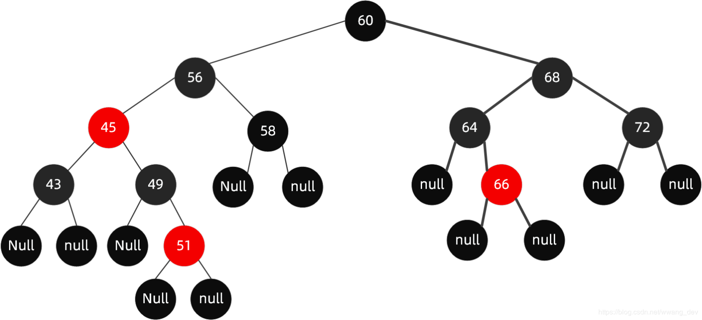
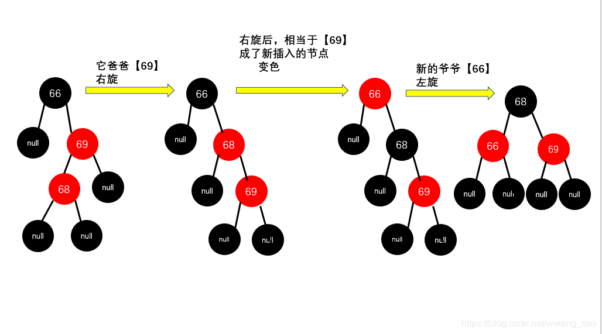

# 红黑树相关笔记
-------
## 红黑树定义
红黑树是一种自平衡二叉查找树，可以在进行插入和删除操作时通过特定的操作保持二叉查找树的平衡，它可以在O(logn)时间内进行查找、插入和删除。
## 红黑树的引入
- 通过引入左右树高度差有限制的平衡二叉树，可以保证查找的时间复杂度在最坏情况下为$O(log_2N)$
- 平衡二叉树左右子树高度差不能超过1，在进行插入/删除操作时，几乎都需要进行旋转操作。
- 红黑树通过牺牲严格的平衡，换取在插入/删除时少量的旋转操作。
  - 红黑树插入时的不平衡，不超过两次旋转就可以解决；删除时的不平衡，不超过三次旋转就能解决。
## 红黑树规则
1. 结点不是黑色，就是红色。
2. 根结点为黑色。
3. 每个叶子结点为黑色（红黑树叶子结点都为NULL）。
4. 每个红色结点的两个子结点必为黑色。
5. 任意结点到每个叶子结点的路径都包含数量相同的黑色结点。

4、5保证了红黑树的大致平衡：根到叶子的所有路径中，最长路径不会超过最短路径的两倍。（最极端为全黑和黑红黑交叉的情况）

## 红黑树应用
- 多路复用技术的epoll核心就是红黑树加双向链表。
- ...

## 红黑树具体操作
### 红黑树结点定义
``` C++
template<class T>
class RB_Tree_Node
{
public:
    RB_Tree_Node(T val);
    ~RB_Tree_Node();

    RB_Tree_Node* Left_Child;
    RB_Tree_Node* Right_Child;
    RB_Tree_Node* Parent;   //父结点，方便迭代插入
    T Data;
    int Color_tag;  //标记结点颜色
}
```
红黑树定义
``` C++
template <class T>
class RB_Tree
{
public:
    RB_Tree_(T Root_Data);
    ~RB_Tree();
    void Left_Rotate(RB_Tree_Node<T>* current_Node);    //左旋操作
    void Right_Rotate(RB_Tree_Node<T>* current_Node);   //右旋操作
    void Insert_Node (T insert_Data);   //插入数据
    int Delete_Node(T delete_Data);     //删除数据
    void Fix_Tree(RB_Tree_Node<T>* current_Node);   //调整树    ----
    void Erase_Node(RB_Tree_Node<T>* current_Node);     //删除结点
    void Fix_Tree_Delete(RB_Tree_Node<T>* current_Node);    //删除数据后调整
    RB_Tree_Node<T>* Find_Successor_Node(RB_Tree_Node<T>* current_Node);
    RB_Tree_Node<T>* Root_Node;     //根结点
}
```
当红黑规则不满足时，需要对结点进行变色或旋转操作。
### 左旋操作
左旋操作会将结点变为右子结点的左子树。具体操作见[CSDN](https://blog.csdn.net/u014454538/article/details/120120216)

相应代码为
``` c++

```
### 右旋操作
右旋操作会将结点变为左子结点的右子树

相应代码为
``` C++

```
### 插入结点
根据二叉搜索树的特性，可以找到合适的位置插入新的结点。标记新的结点为红色，由于其可能破坏了红黑树规则，因此需要借助变色，旋转来调整。下面分情况讨论：
1. 插入后不破坏规则，不需要旋转和变色。
类似下面这种情况，当我们插入值【66】的结点后，

该情况发生的条件可以被总结为**插入结点的父结点为黑色**，此时该路径下黑色结点数并未发生变化。
2. 插入结点后需要变色，但不需要旋转。
例如，当我们插入值【51】的结点后，树变为

结论:
这种情况出现的条件为**插入结点的父结点和叔结点为红色**,此时路径中出现了连续的红色，但只需要进行变色操作即可调整。<br>
具体的变色操作可以被总结为
- step1:此时出现连续红的情况,将下面那个红的结点的父和叔结点变为黑色，然后将爷结点变为红色。
- step2:如果爷结点为根结点，则结束变色，否则，如果爷结点与其父结点又是连续红的情况，则回到step1。
在每一次变色后，爷结点相对于其子孙结点都满足了红黑规则，因此循环到根结点即可。（似乎爷结点要不连续红，要不就是根结点。）<br>
经过上述变色操作后，结果为

3. 插入结点后即要变色，也需要旋转。
先给出例子，当我们在下面这颗树中插入值【65】的结点。

结论：这种结论出现的条件是**插入结点的父结点为红色，但叔结点为黑色**,此时有连续红色结点的情况，直接改变结点颜色又无法满足根结点到任意叶子结点的黑色结点数相同的规则。因此需要旋转。<br>
此时，共有四种情况，但这四种情况最后会化为两种情况。
- 左左插入，父结点和插入的结点都是左结点。<br>
规则：先变色再旋转

观察过程，变色的操作无异，但为了满足红黑规则，我们需要使该段子树中黑色结点数与未插入前一致。因此这样旋转。
- 左右插入，父结点为左结点，插入结点为右结点<br>
规则：先旋转变为左左插入，再变色后插入。

- 右右插入，父结点和插入结点都为右结点（过程类似左左插入）
规则：先变色再旋转

- 右左插入，父结点为右结点，插入结点为左结点<br>
规则：先旋转变为右右插入，再变色后插入。

旋转为左旋或右旋，可以根据结点最终变为左儿子还是右儿子判断。<br>
### 删除结点
删除的操作相对于插入更加复杂，感觉这篇[文章](https://blog.csdn.net/m0_37589327/article/details/78518324?ops_request_misc=&request_id=&biz_id=102&utm_source=distribute.pc_search_result.none-task-blog-2~all~sobaiduweb~default-0)讲的很好。<br>
删除结点可以分为3种情况：
- 待删除结点为叶子结点，直接删除即可。[del_a]
- 待删除结点只有一个孩子，将父结点的指针指向孩子结点即可。[del_b]
- 待删除结点有两个孩子，则需要找它的前驱/后继，可以变为上面两种情况。（如找中继后序结点，后继结点必为叶结点或左空右不空的结点）[del_c]

再根据颜色的不同，删除操作后还需要进行变色或者旋转，但变色和旋转都是为了能够满足红黑规则，即不连续红，黑色结点数与未删除前一致（有特殊情况）。下面是具体的分析：<br>
#### 第三种情况：
该情况可以转变为前面两种情况。
#### 第二种情况：待删除结点有一个孩子
此情况下，待删除结点必定是黑色（如果是红色，则左右子树路径下黑色结点数不同），且唯一的子树也一定是个红色孩子，那么这种情况就好处理了：用红色孩子替换待删除结点，再将其涂成黑色。

#### 第一种情况：待删除结点为叶子结点
如果待删除结点为红色，则可以直接删除。<br>
如果待删除结点为黑色，则需要判断其兄弟和侄子结点的情况来保持黑色结点的数量。
1. 兄弟是黑色结点
- 两个侄子结点都为null，父节点为红色<br>

<br>此时步骤为：父结点涂黑，兄弟结点涂红（为了使该路径下黑色数量为2）

- 两个侄子结点都为null，父节点为黑色<br>

<br>观察可知，此时不管如何调整，都无法使路径下黑色数量变为3,因此，只能先将兄弟结点涂红，再对父结点进行下一步的调整。

- 左侄子结点为红色<br>

<br>这里的调整使为了调整黑色结点的数量。具体操作见图：
- 右侄子结点为红色

2. 兄弟结点为红色<br>
兄弟结点为红色，可以先转换成兄弟结点为黑色的情况。<br>
具体操作：<br>


至此，左孩子结点情况分析完，右孩子结点的分析是一样的。